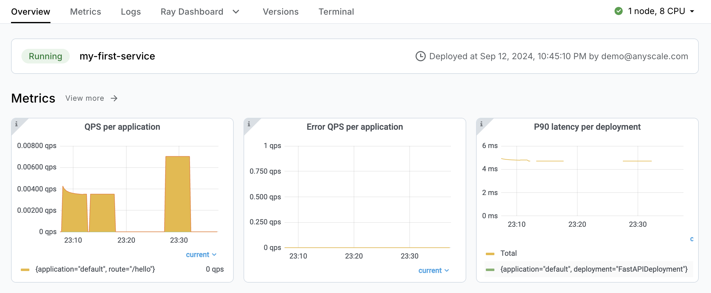

# Introduction to Anyscale Services

**⏱️ Time to complete**: 5 min

This tutorial shows you how to:

1. Deploy Anyscale Services
2. Query the service
3. View and monitor Anyscale Services in Anyscale UI.

## When to use Anyscale Services

We recommend deploy Ray Serve apps as Anyscale Services if the following features are needed: 
- Zero down time upgrade / canary rollout
- High availability
- Programmatic submission API & CI/CD integration

**Note**: In open source Ray, users deploy Ray apps with Ray Serve API. Anyscale Services leverage Ray Serve API to deploy Ray apps on standalone Ray Clusters and manage the lifecycle of them. It also provides the additional features listed above. No code change to your Ray script is needed when deploying your existing Ray apps as Anyscale Services.

## Deploy an Anyscale Service

You can deploy services from any machines, using the Anyscale CLI or SDK. In this tutorial, we use Anyscale CLI as an example. 
### Step 1: install Anycale CLI and authenticate
```bash
# Install Anyscale CLI
$ pip install -U anyscale
# Authenticate
$ anyscale login
```

### Step 2: Deploy an Anyscale Service
This example includes a simple Ray app that runs a few [Ray tasks](https://docs.ray.io/en/latest/ray-core/key-concepts.html#tasks). Run the following command to deploy it as an Anyscale Service

```bash
$ anyscale service deploy -f service.yaml
```
This example includes two important files <br>
- service.yaml: define the import path and configs of your service. Learn more about the [supported fields](https://docs.anyscale.com/reference/service-api#serviceconfig). <br>
- main.py: the actual Ray script to deploy

 It's also possible to deploy your Ray script directly without using YAML files. However, YAML files are recommended when dealing with Services with more complicated configs. For more details, check out the [Anyscale Service reference](https://docs.anyscale.com/reference/service-api).


### Step 3: Query the service

#### 3.1 Set the input for your request as environment variables
- bearer token: used for authenticate your request
- base URL: the URL of this service
- name: this is query parameter specific to your Ray script

```bash
BEARER_TOKEN=<replace with the bearer token of your service>
BASE_URL=<replace with the base URL of your service>
NAME=<provide a name>
```

#### 3.2 Query the endpoint
Use the input above to hit the endpoint defined in your Ray script  (`/hello` in this example) with proper input.
```bash
curl -H "Authorization: Bearer $BEARER_TOKEN" "$BASE_URL/hello?name=$NAME"
```


##  Monitor with in Anyscale Console UI

The output from the CLI command above should print the URL to your service in Anyscale UI. You can view the service state, logs, metrics, and Ray Dashboard in the UI.




##  Clean up the resoruces
Terminate the service by clicking the button  in the top right corner of the UI or run the follow command:
```bash
$ anyscale service terminate -n my-first-service
```

## Summary

This tutorial shows your how to:
1. Deploy Anyscale Services
2. Query the service
3. View and monitor Anyscale Services in Anyscale UI.

Check out [Anyscale Services documentation](https://docs.anyscale.com/platform/services/) for more gudies:
- upgrade a service
- configure the autoscaling of deployment replicas
- monitoring and debugging
- and much more